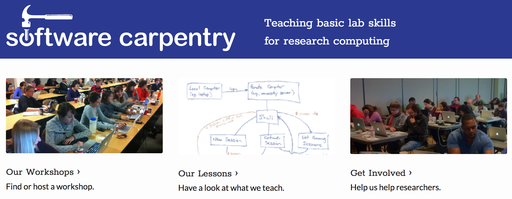
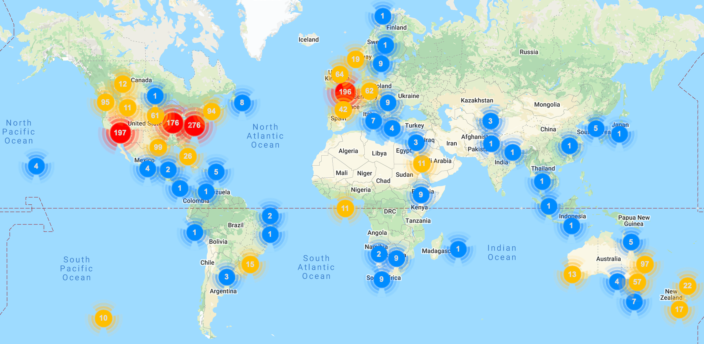
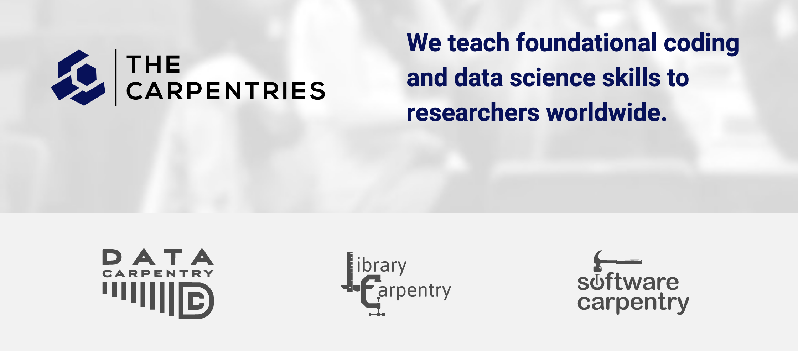
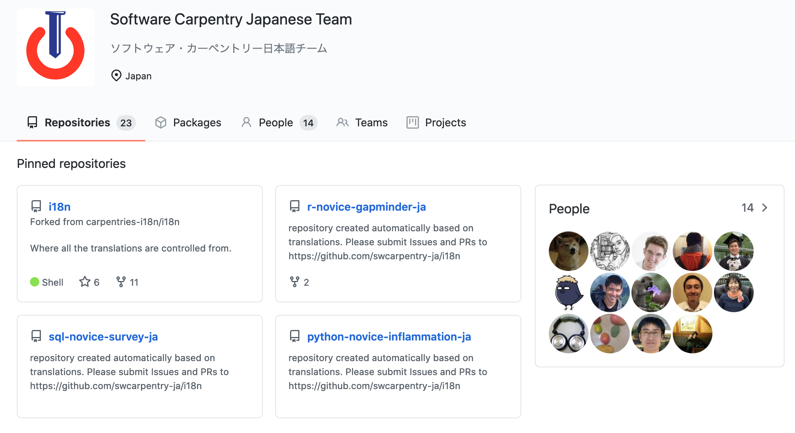
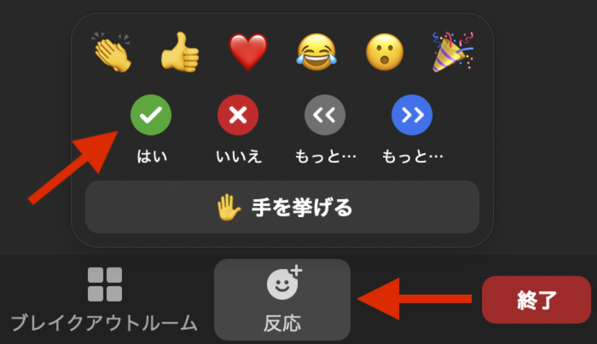
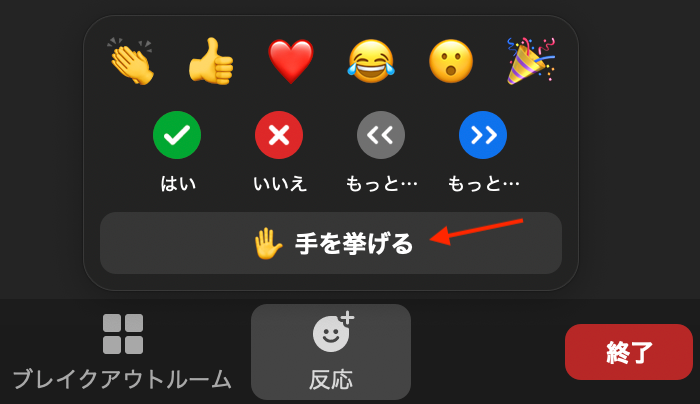
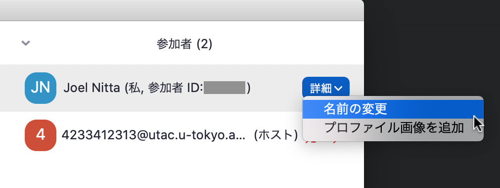

```{r setup, include=FALSE}
knitr::opts_chunk$set(echo = TRUE)
library(xaringanthemer)
library(tidyverse)
```

```{r xaringan-themer, include=FALSE, warning=FALSE}
# Set up slide theme
style_mono_accent(
  base_color = "#2B3990",
  header_font_google = google_font("Noto Sans JP"),
  text_font_google   = google_font("Noto Sans JP", "300", "300i"),
  code_font_google   = google_font("Fira Mono"),
  text_font_size = "1.2em",
  link_color = "#F95D9B"
)
```

background-image:url(images/title-image.png)
background-size: 35%
background-position: 90% 95%

# R によるデータ解析入門

### ソフトウェアカーペントリー日本<br>Beyond AI

<span style = 'font-size: 120%;'>2021/04/02 &ndash; 2021/04/16</span>

<br><br>

---

## 一日目 アウトライン

- B'AIの紹介

- スタッフの紹介

- ソフトウェアカーペントリーの紹介

- ワークショップのやり方について

- Ice breaker

- ソフトのインストール

---

## B'AIの紹介

---

## スタッフの紹介

.pull-left[
ニッタ ジョエル（インストラクター）

@joel_nitta

- 特任助教

- 理学系岩崎研究室

- 研究テーマ：シダ植物の進化、生態学、ゲノム解析

- 趣味：マラソン
]

.pull-right[

]

---

## スタッフの紹介

.pull-left[
武井陸良（インストラクター）

@rikutakei

- 研究員

- アラバマ大学バーミンガム校

- 研究テーマ：痛風の遺伝要因、ゲノム解析

- 趣味：ロッククライミング
]

.pull-right[

]


---
## スタッフの紹介

.pull-left[
ケリートム（ヘルパー）

@tomkxy

- 研究員(ポスドク)

- 理化学研究所 生命医科学研究センター

- 研究テーマ：多能性幹細胞、がんゲノム解析、シングルセルRNA解析

- 趣味：日本語を勉強、映画、旅行
]

.pull-right[

]

---
## スタッフの紹介

.pull-left[
西田 孝三（ヘルパー）

@kozo2

- 技術員

- 理化学研究所 生命機能科学研究センター

- 研究テーマ：パスウェイ関連データの統合・可視化・解析

- 趣味：オープンサイエンスコミュニティの運営
]

.pull-right[

]

---
## スタッフの紹介
.pull-left[
山口雅美（ヘルパー）

@Masami20532423

- 図書館員

- グリフィス大学 (オーストラリア）

- カーペントリーズのインストラクター、トレイナー、Executive Council Member

- 好きな食べ物: ポップコーン、おせんべい
]

.pull-right[

]

---

## Software Carpentry (SWC) とは？

.middle[
- 無償でコードを教えるワークショップ

- ボランティアによって運営されている

- 研究者にコードのベストプラクティスを教える
]



.center[https://software-carpentry.org/]

---

### アメリカをはじめ、様々な国で実施



---

## ワークショップ

- 研究者が**コミュニティを作って**、互いに教え合う

- フィードバックを重視する

- 二日間にわたるワークショップ

- ３−４レッスンを教える（今回はRのみ）

.center[]

---

## ザ・カーペントリーズ

Data Carpentry, Library Carpentry, Software Carpentry



---
## ザ・カーペントリーズ日本

- ボランティアからなる多国籍なグループが教材を日本語に翻訳している

- コミュニティーを一緒に支える方を探しています！

.center[]

---
## 参加者大募集中

- Twitter: @swcarpentry_ja

- Slack: https://carpentries-jp-en.herokuapp.com/ からアクセス

- GitHub: https://github.com/swcarpentry-ja/i18n/

- Meetup: 二ヶ月ごとにzoomで

.center[]

---
## SWCワークショップの流れ

- スライドによる内容の説明

- **ライブコーディング**

---
## ライブコーディングとは？

- インストラクターが打っていると同じコードを同時に自分のパソコンで打って行く

--

- インストラクターが参加者の理解を確認する（「〜が出来ましたか？」）

- zoomの「反応」をクリック→「はい」、「いいえ」　

.center[]

---
## ライブコーディングとは？

何か問題があった時に**声をかける**

--

- zoomの「反応」をクリック→「手を挙げる」

あるい（また）は

- zoomのチャットに質問を投げる

.center[]

---
## フィードバックの種類

- クイズ（zoomの投票機能）

- 感想（グーグルフォーム、グーグルドック）

- ディスカッション（ブレークアウトルーム）

---
## Zoomの使い方のお願い

.pull-left[
- カメラを常にオン

- 名前の変更
  - 例：東大 太郎（理学部 M2）
  - インストラクター、ヘルパー、見学に来ている方はそのステータスを記入
]

.pull-right[
.center[]

.center[]
]

### 積極的に発言してください！`r emo::ji("slightly smiling face")`

---

## Ice breaker

４−５人ずつブレークアウトルームで自己紹介しましょう

- どうやってRを知りましたか？

- 趣味は何ですか？

---

## ソフトのインストール

- **R** https://cloud.r-project.org/

  - `R.version.string`を打って、結果をチャットに貼ってください

- **RStudio** https://rstudio.com/products/rstudio/download

- **Zoom** https://zoom.us/jp-jp/home.html

- **tidyverse**

  - `install.packages("tidyverse")`

---

## 二日目 アウトライン

- RStudio入門

- Rを計算機としての使用

- 変数

（休憩）

- 関数

- RStudioを使ったプロジェクト管理

- ヘルプ機能

---

## なぜRを使うのか

- 無料だから

- パッケージが豊富

- Rコードを使うことによって統計解析の再現性が上がる

---

## RStudioって何？

- 総合開発環境（IDE - Integrated Development Environment）

- コードを書く場所（エディタ）とそれを実行するプログラム（R）が合わさったソフトウェアのこと

- プロジェクト管理など、他にも便利機能がついています

---

### チャレンジ

以下の変数名のうち、Rで使える変数名はどれでしょう？（複数可）

1. min-height
2. max.height
3. _age
4. celsius2kelvin
5. MaxLength

---
### 答え

1. ~~min-height~~
2. **max.height**
3. ~~_age~~
4. **celsius2kelvin**
5. **MaxLength**

---
### 関数とは？

何かの値（インプット）を受けて、処理して、計算結果（アウトプット）を返すもの

.center[]

.footnote[https://manamina.valuesccg.com/articles/756]

---
### 関数とは？

関数の書き方：

`関数名(引数)`

関数の例：`print()`、`paste()`

---
### チャレンジ

`toupper`はインプットの文字列を大文字にする関数です。`toupper`を使った、私の名前（"joel"）を大文字にするコードはどれが正しいでしょうか？

1. `toupper["joel"]`
2. `toupper(joel)`
3. `toUpper("joel")`
4. `toupper("joel")`
5. `toupper, "joel"`

---
### 答え

`toupper`はインプットの文字列を大文字にする関数です。`toupper`を使った、私の名前（"joel"）を大文字にするコードはどれが正しいでしょうか？

1. ~~`toupper["joel"]`~~
2. ~~`toupper(joel)`~~
3. ~~`toUpper("joel")`~~
4. **`toupper("joel")`**
5. ~~`toupper, "joel"`~~

---

### RStudio によるプロジェクト管理

よくあること：

.center[]

---

### RStudio によるプロジェクト管理

よくあること：

.center[]

---

### 問題

1. データのバージョン（原本か修正版か）が分かりません

2. コードのバージョンが分かりません

3. 知りたい結果（図など）を探すのに時間がかかります

4. 図とその図を出力するコードの対応が分かりません

--

以上の問題を解決することによって、**しばらく手をつけていなくても、簡単にプロジェクトを再開できる**

---

### RStudioで新しいプロジェクトを作成しましょう

1. "File" メニューボタンをクリックし、"New Project"をクリック
2. "New Directory"をクリック
3. "Empty Project"をクリック
4. プロジェクトを保存するディレクトリの名前をタイプ（例 "my_project"）
5. 可能なら、"Create a git repository"のチェックボックスを選択
6. "Create Project" ボタンをクリック

---

### プロジェクト管理の最適なやり方

1. データは読み込み専用にしましょう

2. 生成されたアウトプットを捨てても良いようにしましょう

3. 関数定義と適用は別々にしましょう

---

### チャレンジ：データディレクトリにデータを保存する

ギャップマインダーのデータを[ここから](https://raw.githubusercontent.com/swcarpentry/r-novice-gapminder/gh-pages/_episodes_rmd/data/gapminder_wide.csv)ダウンロードしましょう

1. ファイルをダウンロードする（CTRL + S、右マウスクリック -> 「名前を付けて保存する」、またはファイル ->「ページを名前を付けて保存する」)

2. 確実に `gapminder_data.csv` という名前で保存しましょう

3. プロジェクトの中にある `data/` フォルダに保存しましょう

このデータは後で読み込んで色々調べます

---

## 三日目 アウトライン

- 二日目のおさらい

- データ型について

- ベクトルの使い方１

（休憩）

- ベクトルの使い方２

- データフレームの使い方

- データフレームからデータを抜き出す

---

## 四日目 アウトライン

- 三日目のおさらい

- `filter()`、`select()`、`mutate()`関数を使ってみる

- `group_by()`と`summarise()`関数を使って基本的な計算をしてみる

（休憩）

- `ggplot2`パッケージについて

- レイヤーの仕組み

- `ggplot()`関数を使って図を作成してみる

---

## 五日目 アウトライン

- 四日目のおさらい

- グループ別に色や形を変えてみる

- `ggsave()`関数で図を保存する

（休憩）

- `rmarkdown`でレポートを作成する（仮）

