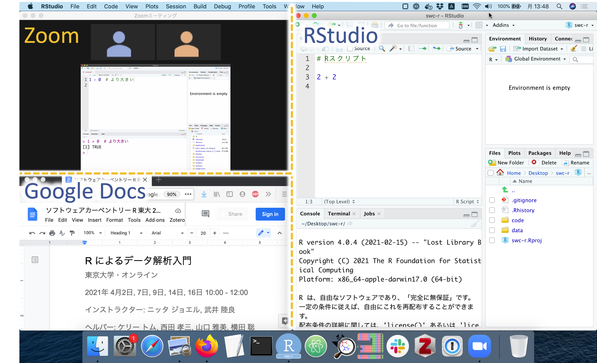

```{r setup, include=FALSE}
knitr::opts_chunk$set(echo = TRUE)
library(xaringanthemer)
library(tidyverse)
```

```{r xaringan-themer, include=FALSE, warning=FALSE}
# Set up slide theme
style_mono_accent(
  base_color = "#2B3990",
  header_font_google = google_font("Noto Sans JP"),
  text_font_google   = google_font("Noto Sans JP", "300", "300i"),
  code_font_google   = google_font("Fira Mono"),
  text_font_size = "1.2em",
  link_color = "#F95D9B",
  extra_css = list(
    ".grey" = list("color" = "grey")
  )
)
```

background-image:url(images/title-image.png)
background-size: 35%
background-position: 90% 95%

# R によるデータ解析入門

### ソフトウェアカーペントリー日本<br>Beyond AI

<span style = 'font-size: 120%;'>2021/04/02 &ndash; 2021/04/16</span>

<br><br>

---

## 一日目 アウトライン

- B'AIの紹介

- スタッフの紹介

- ソフトウェアカーペントリーの紹介

- ワークショップのやり方について

- Ice breaker

- ソフトのインストール

**ワークショップの録画・録音・撮影・スクリーンショット等は<br>ご遠慮ください**

---

## B'AIの紹介

---

## スタッフの紹介

.pull-left[
ニッタ ジョエル（インストラクター）

@joel_nitta

- 特任助教

- 理学系岩崎研究室

- 研究テーマ：シダ植物の進化、生態学、ゲノム解析

- 趣味：マラソン
]

.pull-right[

]

---
## スタッフの紹介

.pull-left[
武井陸良（インストラクター）

@rikutakei

- 研究員

- アラバマ大学バーミンガム校

- 研究テーマ：痛風の遺伝要因、ゲノム解析

- 趣味：ロッククライミング
]

.pull-right[

]

---
## スタッフの紹介

.pull-left[
ケリートム（ヘルパー）

@tomkxy

- 研究員(ポスドク)

- 理化学研究所 生命医科学研究センター

- 研究テーマ：多能性幹細胞、がんゲノム解析、シングルセルRNA解析

- 趣味：日本語を勉強、映画、旅行
]

.pull-right[

]

---
## スタッフの紹介

.pull-left[
西田 孝三（ヘルパー）

@kozo2

- 技術員

- 理化学研究所 生命機能科学研究センター

- 研究テーマ：パスウェイ関連データの統合・可視化・解析

- 趣味：オープンサイエンスコミュニティの運営
]

.pull-right[

]

---
## スタッフの紹介
.pull-left[
山口雅美（ヘルパー）

@Masami20532423

- 図書館員

- グリフィス大学 (オーストラリア）

- カーペントリーズのインストラクター、トレイナー、Executive Council Member

- 好きな食べ物: ポップコーン、おせんべい
]

.pull-right[

]

---
background-image:url(images/Beyond_AI-TheCarpentriesPresentation-0.png)
background-position: center
background-size: contain

---
background-image:url(images/Beyond_AI-TheCarpentriesPresentation-1.png)
background-position: center
background-size: contain

---
background-image:url(images/Beyond_AI-TheCarpentriesPresentation-2.png)
background-position: center
background-size: contain

---
background-image:url(images/Beyond_AI-TheCarpentriesPresentation-3.png)
background-position: center
background-size: contain

---
background-image:url(images/Beyond_AI-TheCarpentriesPresentation-4.png)
background-position: center
background-size: contain

---
background-image:url(images/Beyond_AI-TheCarpentriesPresentation-5.png)
background-position: center
background-size: contain

---
background-image:url(images/Beyond_AI-TheCarpentriesPresentation-6.png)
background-position: center
background-size: contain

---
background-image:url(images/Beyond_AI-TheCarpentriesPresentation-7.png)
background-position: center
background-size: contain

---
background-image:url(images/Beyond_AI-TheCarpentriesPresentation-8.png)
background-position: center
background-size: contain

---
background-image:url(images/Beyond_AI-TheCarpentriesPresentation-9.png)
background-position: center
background-size: contain

---
background-image:url(images/Beyond_AI-TheCarpentriesPresentation-10.png)
background-position: center
background-size: contain

---
## 行動規範

どなたでも気兼ねなくワークショップに参加できるように、[行動規範](https://carpentries-coc.readthedocs.io/ja/latest/topic_folders/policies/code-of-conduct.html)があります。

行動規範に反する行為があった場合は、[インシデントレポートフォーム](https://docs.google.com/forms/d/e/1FAIpQLSeYqO37p0P-5JsEoF-E_edpZM5iRdFxWHTFqILo6LzqGS33YQ/viewform?fbzx=-8556883400541824673)で報告することができます。

---
## SWCワークショップの流れ

- スライドによる内容の説明

- **ライブコーディング**

---
## ライブコーディングとは？

- インストラクターが打っていると同じコードを同時に自分のパソコンで打っていく

--

- インストラクターが参加者の理解を確認する（「〜が出来ましたか？」）

- zoomの「反応」をクリック→「はい」、「いいえ」　

.center[]

---
## ライブコーディングとは？

何か問題があった時に**声をかける**

--

- zoomの「反応」をクリック→「手を挙げる」

あるい（また）は

- zoomのチャットに質問を投げる

.center[]

---
## コラボレイティブ・ノート

[Googleドキュメント](https://docs.google.com/document/d/1G11-8sXl5hbb71ky-YmeHpDvPWXkp0Y-Q65V-59-z78/edit#heading=h.414fvxu27my1)にコードを貼っておきます。

もしインストラクターが進んで、コードが見えなくなったら、<br>Googleドキュメントを参照してください。

### 参加者も自由に書き込んでいいです

---
## 画面設定のおすすめ



---
## フィードバックの種類

- クイズ（zoomの投票機能）

- ディスカッション（ブレークアウトルーム）

- 感想（googleフォーム）

- ワークショップ前後の[アンケート](https://carpentries.typeform.com/to/CvmMM8re?slug=2021-04-02-todai-online-ja)

---
## Zoomの使い方のお願い

.pull-left[
- カメラを常にオン

- 名前の変更
  - 例：東大 太郎（理学部 M2）
  - インストラクター、ヘルパー、見学に来ている方はそのステータスを記入
]

.pull-right[
.center[]

.center[]
]

### 積極的に発言してください！`r emo::ji("slightly smiling face")`

---

## Ice breaker

４−５人ずつブレークアウトルームで自己紹介しましょう

- どうやってRを知りましたか？

- 研究テーマは何ですか？

- 趣味は何ですか？

---

## ソフトのインストール

- **R** https://cloud.r-project.org/

- **RStudio** https://rstudio.com/products/rstudio/download

- **Zoom** https://zoom.us/jp-jp/home.html

- **tidyverse**

  - `install.packages("tidyverse")`

[ワークショップのホームページ](https://swcarpentry-ja.github.io/2021-04-02-todai-online-ja/)
